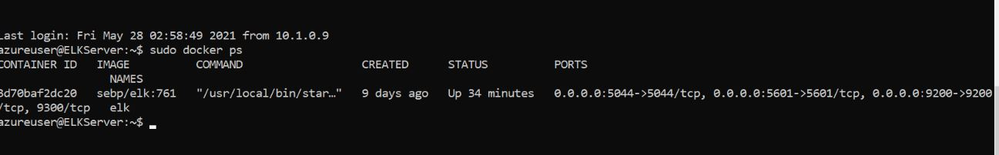

## Automated ELK Stack Deployment

The files in this repository were used to configure the network depicted below.

These files have been tested and used to generate a live ELK deployment on Azure. They can be used to either recreate the entire deployment pictured above. Alternatively, select portions of the _____ file may be used to install only certain pieces of it, such as Filebeat.

   [Install Elk Server](Ansible/install-elk.yml)
   
   [Install DVWA on Webservers](Ansible/dvwa-playbook.yml)
   
   [Install FileBeat on Elk Server](Ansible/filebeat-playbook.yml)
   
   [Install MetriBeat on Elk Server](Ansible/metricbeat_playbook.yml)

This document contains the following details:
- Description of the Topologu
- Access Policies
- ELK Configuration
- Beats in Use
- Machines Being Monitored
- How to Use the Ansible Build

### Description of the Topology

The main purpose of this network is to expose a load-balanced and monitored instance of DVWA, the D*mn Vulnerable Web Application.

Load balancing ensures that the application will be highly available, in addition to restricting access to the network.

## What aspect of security do load balancers protect? What is the advantage of a jump box?_
   Answer: Load balancer defends an organization against distributed denial-of-service(DDoS). Forcing traffic through this Jump box (gateway router) will help in securing
           monitoring this single node is much easier than securing and monitoring each individual VM behind the gateway. 
  
Integrating an ELK server allows users to easily monitor the vulnerable VMs for changes to the auditlogs and system logs.
## What does Filebeat watch for? 
   Answer: Filebeat monitors log files, collects log events and forwards them either to Elasticsearch or Logstash for indexing

## What does Metricbeat record?_
   Answer: Metricbeat records metrics from the systems and services running on the server eg. CPU, Memory etc, and then ouput to Elasticsearch or Logstash.

The configuration details of each machine may be found below.
 

| Name      | Function              | Public/Private IP Address | Operating System |
|-----------|-----------------------|---------------------------|------------------|
| Jump Box  | Gateway               | 40.115.72.100 / 10.1.0.9  | Linux            |
| Web-1     | Webserver             | 10.1.0.10                 | Linux            |
| Web-2     | Webserver             | 10.1.0.11                 | Linux            |
| Elk       | Elasticsearch server  | 20.36.45.112 /  10.0.0.5  | Linux            |

### Access Policies

The machines on the internal network are not exposed to the public Internet. 

  Only the Jump box and Elkserver machine can accept connections from the Internet. Access to this machine is only allowed from the following IP addresses:
  Jumpbox:  40.115.72.100
  Elkserver: 20.36.45.112

Machines within the network can only be accessed by Jumpbox.
## Which machine did you allow to access your ELK VM? What was its IP address?
   Answer: Jump Box  10.1.0.9   
               
A summary of the access policies in place can be found in the table below.

| Name     | Publicly Accessible | Allowed IP Addresses |
|----------|---------------------|----------------------|
| Jump Box | Yes                 | 40.115.72.100        |
|   Elk    | Yes                 | 20.36.25.112         |
|          |                     |                      |

### Elk Configuration

Ansible was used to automate configuration of the ELK machine. No configuration was performed manually, which is advantageous because...
## What is the main advantage of automating configuration with Ansible?_
   Answer: Ansibles automates and simplifies the repetitive, complex and tedious operation. Automated configuration will do exactly the same thing evey time they run, elimination
        as much variability between configuration as possible. 
 
The playbook implements the following tasks:
## In 3-5 bullets, explain the steps of the ELK installation play. E.g., install Docker; download image; etc._
   Answer: 
       	1) Install Docker using Docker.io
       	2) Install python3-pip 
        3) Install Docker python module
	4) Increase virtual memory
	5) Download Docker container called sebp/elk:761
	 

The following screenshot displays the result of running `docker ps` after successfully configuring the ELK instance.

 

 Target Machines & Beats

This ELK server is configured to monitor the following machines:

*Web-1 : 10.1.0.10

*Web-2 : 10.1.0.11

 We have installed the following Beats on these machines:
   Answer: Successfully installed FileBeat and MetricBeat

These Beats allow us to collect the following information from each machine:

 -FileBeat collects all the login attempt irrespective of successfull or unsuccessful. Help  to track user logon events 
      
  [FileBeat-example](Diagram/Filebeat-Login-example.JPG)
	   
  -MetricBeat collect the data from you systems and services. Example  CPU usage to memory engaged, even metricbeat send sytem and services statistics. 
	   
  [MetricBeat-example](Diagram/MetricBeat-CPU-Usage-Example.JPG)
                

### Using the Playbook
In order to use the playbook, you will need to have an Ansible control node already configured. Assuming you have such a control node provisioned: 

SSH into the control node and follow the steps below:
- Copy the _____ file to _____.
- Update the _____ file to include...
- Run the playbook, and navigate to ____ to check that the installation worked as expected.

  Answer the following questions to fill in the blanks:_
   - File name is install-elk.yml and copy to /etc/ansible/install-elk.yml
   - Navigate  /etc/ansible/hosts inm terminal, nano hosts file and update the [elk] with 
      10.0.0.5   ansible_python_interpreter=/usr/bin/python3
    - https://[your-elk-vm-public-ip]:5601/app/kibana to check that installation worked as    
      expected

_As a **Bonus**, provide the specific commands the user will need to run to download the playbook, update the files, etc._

On the Jump box run the following command to get the playbook: curl https://github.com/spatel-cybersecurity/Elk-Deployment/main/Ansible/install-elk.yml > /etc/ansible/install.elk.yml  

Edit the hosts file in /etc/ansible and add the below details in [elk] section of host file  
your-elk-private-ip   ansible_python_interpreter=/usr/bin/python3 

To run the Playbook: ansible-playbook /etc/ansible/install-elk.yml

Check your installation is working as expected using the link in a browser: http://[your_elk_server_ip]:5601/app/kibana

After successfull launching Kibana in browser, start install FileBeat
Install FileBeat playbook using command to get the playbook in Elk VM: curl https://github.com/spatel-cybersecurity/Elk-Deployment/main/Ansible/filebeat-playbook.yml > /etc/ansible/filebeat/filebeat-playbook.yml

Run Filebeat Playbook: ansible-playbook /etc/ansible/filebeat/filebeat-playbook.yml 

Next bit is installing MetriBeat, 
Download MetricBeat playbook by running command in Elk VM: curl https://github.com/spatel-cybersecurity/Elk-Deployment/main/Ansible/metribat-playbook.yml > /etc/ansible/metrics/metricbeat-playbook.yml

Run MetricBeat Playbook: ansible-playbook /etc/ansible/metric/metricbeat-playbook.yml

Install 
